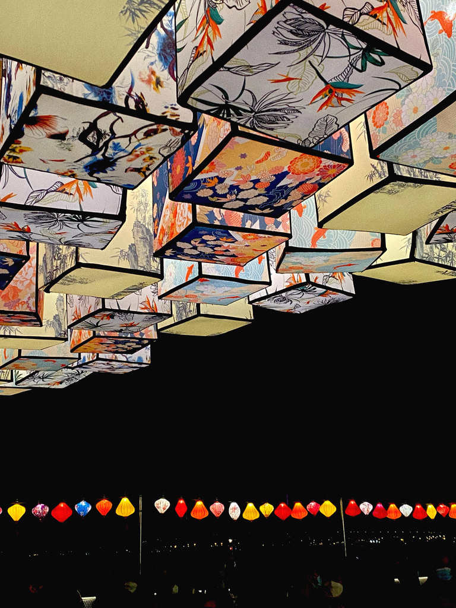
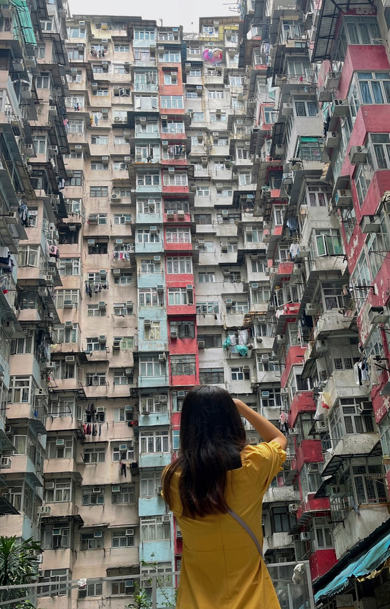
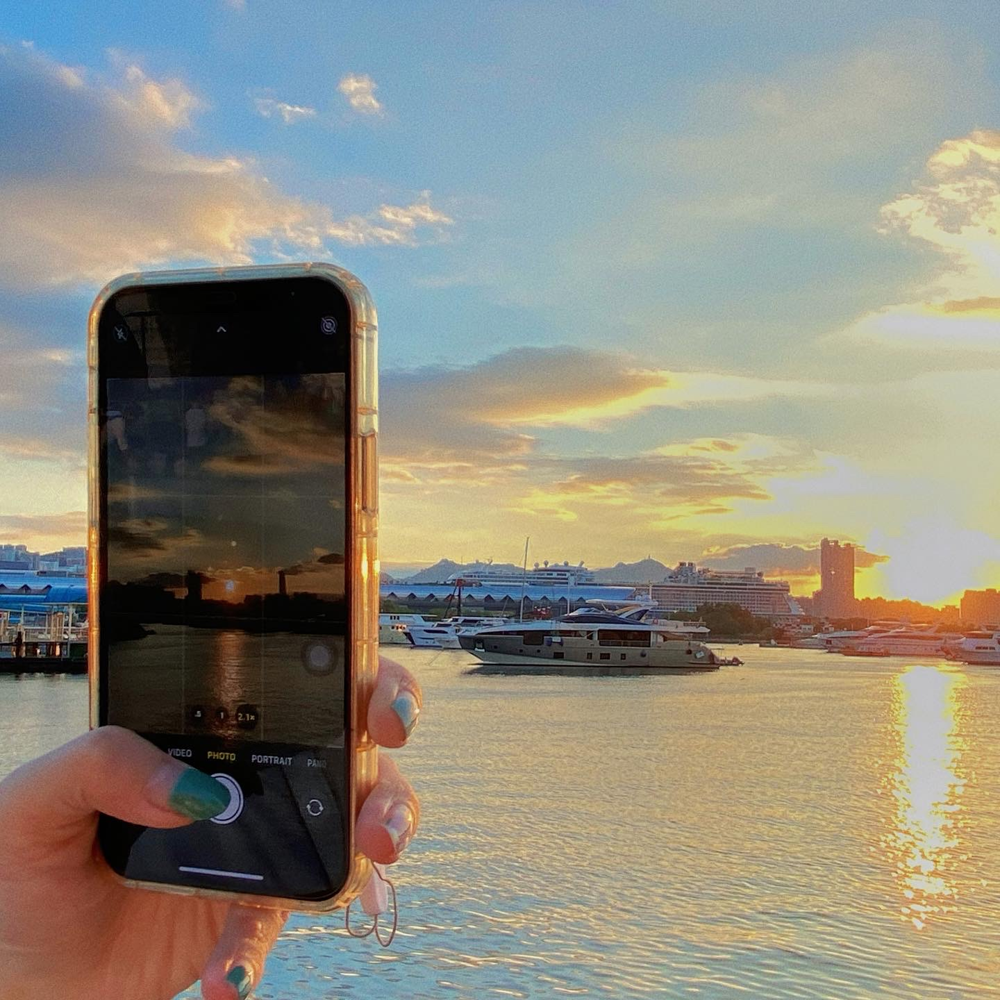

### Photographing

<figure>
    
    <figcaption>In Kennedy Town.</figcaption>
</figure>

&nbsp;

<figure>
    
    <figcaption>In Monster Building.</figcaption>
</figure>

&nbsp;

<figure>
    
    <figcaption>In Kwun Tong.</figcaption>
</figure>

&nbsp;

<figure>
    
    <figcaption>In Ngong Ping.</figcaption>
</figure>

&nbsp;

<figure>
    
    <figcaption>In Braemar Hill. With [Qipeng](https://kippon.github.io) and [Haoyu](https://yin-hy.github.io).</figcaption>
</figure>

&nbsp;

### Foodie, Coffee, and Restaurant Touring

<figure>
    
</figure>

&nbsp;

<figure>
    
</figure>

&nbsp;

### Kpop

Especially [izone](https://en.wikipedia.org/wiki/Iz*One) and [Yiren](https://kpop.fandom.com/wiki/Yiren).

### Other Hobbies

1) Close the activity rings ([figure coming later](https://www.tomsguide.com/reference/apple-watch-rings-what-they-mean-and-how-to-close-them)).

2) Playing SHUANGSHENG.

[back](./)
